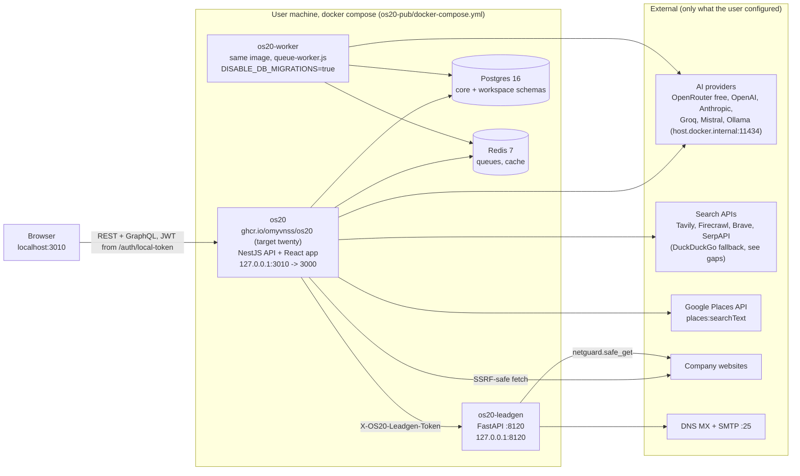
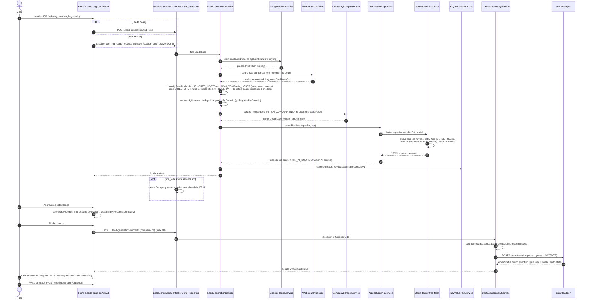

# OS20 Architecture

Status as of 2026-09-21, branch `os20/hardening`. Paths are relative to the repo root
(`/Users/omyadav/os20`) unless they start with `os20-pub/`. Server paths are under
`packages/twenty-server/src/engine/` and front paths under `packages/twenty-front/src/`
unless written in full.

## 1. Overview

OS20 is a local-first, zero-login CRM built on a fork of Twenty. The user runs one
command (`os20-pub/install.sh` or `npx os20-cli`), which writes a `.env` with generated
secrets and starts one docker compose stack: the OS20 server (NestJS API plus the React
app), a queue worker, a small Python lead engine sidecar, Postgres and Redis. Every port
binds to `127.0.0.1`. The user pastes keys in the UI: one AI model key (OpenRouter free
models, OpenAI, Anthropic, Groq, Mistral, or a keyless local Ollama), one search key
(Tavily, Firecrawl, Brave, SerpAPI) and an optional Google Places key. Keys are encrypted
per workspace in Postgres. The lead engine finds companies (Places first, then web
search), scrapes their sites, scores them with the user's AI key, keeps them in a saved
leads list, and lets the user approve them into Companies, discover contacts, check email
status and write outreach. All CRM data stays in the local Postgres volume; the only
outbound calls are to the providers the user configured and to the company websites and
mail servers being checked.

## 2. Containers

Health gating (the worker crash-loop incident rule): `os20-worker` has
`depends_on` `os20`, `db`, `redis` all `service_healthy`. `os20` waits on `db` and `redis`
and is healthy when `curl http://localhost:3000/healthz` passes. `os20-leadgen` has its
own `/health` check but no `depends_on os20` yet (see section 7).

## 3. Lead pipeline

Notes:
- Places leads without a website are keyed by place id (`externalId`) and get
  `NO_WEBSITE_SCORE_PENALTY` (20) in `ai-lead-scoring.service.ts`.
- If the AI call fails, leads keep a heuristic `fallbackScore` and are not filtered.
- AI model order when no model is chosen: `lead-byok.service.ts` PREFERENCE list
  (OpenRouter `nvidia/nemotron-3-super-120b-a12b:free`, OpenAI, Groq, Anthropic, Google),
  then the first local Ollama model.
- Free model order: `PREFERRED_FREE_OPENROUTER_MODELS` in
  `core-modules/ai-provider/utils/openrouter-free-fetch.util.ts`, then the live free list
  from `openrouter.ai/api/v1/models` (cached 1 h), up to 5 attempts.

## 4. Module map

| Module | Responsibility | Key files | Endpoints / tools |
|---|---|---|---|
| Lead generation controller | REST entry for the lead engine, guarded | `core-modules/lead-generation/lead-generation.controller.ts` | `GET sources`, `GET leads`, `DELETE leads/:key`, `POST sources-search`, `POST find`, `POST outreach`, `POST outreach/bulk`, `POST contacts` (all under `/lead-generation`) |
| Pipeline orchestration | Places then web, URL classing, dedupe, scrape, score, save | `lead-generation/services/lead-generation.service.ts` | used by `find`, `find_leads` |
| Web search | Search key via WebSearchToolService, DuckDuckGo lite/html fallback, sequential queries | `lead-generation/services/web-search.service.ts`, `web-search-apis/services/web-search-tool.service.ts` | `web_search` tool |
| Google Places | Text search with the workspace key, field mask | `web-search-apis/services/google-places.service.ts` | none directly |
| Company scraper | Fetch homepage, name, description, emails, phone, size; bot page detection | `lead-generation/services/company-scraper.service.ts`, `utils/company-name.util.ts` | none |
| AI scoring + outreach | Batch JSON scoring, fallback score, outreach text | `lead-generation/services/ai-lead-scoring.service.ts`, `lead-byok.service.ts` | `outreach`, `outreach/bulk` |
| Saved leads | One JSONB list per workspace, merge by key, max 500 | `lead-generation/services/lead-persistence.service.ts` | `leads`, `DELETE leads/:key` |
| Contact discovery | Team page parsing, people, email status via sidecar | `lead-generation/services/contact-discovery.service.ts`, `utils/team-page-extraction.util.ts`, `lead-enrichment.service.ts` | `POST contacts`, `find_company_contacts` |
| Candidate + domain utils | Non-company hosts, registrable domain, dedupe | `lead-generation/utils/lead-candidate.util.ts`, `utils/registrable-domain.util.ts` | none |
| Legacy sources | 15 per-source searchers (see section 7) | `lead-generation/services/lead-sources.service.ts` | `sources`, `sources-search` |
| AI tools | `find_leads`, `find_company_contacts`, `save_contacts` (found/verified emails only) | `lead-generation/tools/find-leads-tool.provider.ts` | AI chat tools |
| Web search keys | Store and test search and Places keys, masked | `web-search-apis/web-search-api.controller.ts`, `web-search-api.service.ts`, `constants/web-search-api-providers.constant.ts` | `GET/POST /web-search-apis`, `POST /web-search-apis/test`, `DELETE /web-search-apis/:id` |
| AI provider keys | BYOK store, provider registry, free OpenRouter fetch | `core-modules/ai-provider/*`, `services/api-key.service.ts`, `providers/openrouter.provider.ts` | `GET providers`, `GET models`, `POST complete`, `GET keys`, `POST/DELETE keys/:provider` (under `/ai-provider`) |
| AI models registry | Catalog, BYOK key injection, SDK factory (OpenRouter uses free fetch) | `metadata-modules/ai/ai-models/services/ai-model-registry.service.ts`, `sdk-provider-factory.service.ts`, `ai-providers.json` | none |
| AI chat | System prompt routes lead asks to `find_leads`; preloaded tools | `metadata-modules/ai/ai-chat/constants/chat-system-prompts.const.ts`, `ai-chat-tool-names-to-preload.const.ts` | chat |
| Zero-login | Issue local token only for allowed hosts with `SKIP_AUTH=true` | `core-modules/auth/controllers/local-auth.controller.ts` | `GET /auth/local-token` |
| Secrets | enc:v2 AES-GCM bound to workspace, legacy CBC decrypt | `core-modules/os20-secrets/os20-secret-cipher.service.ts` | none |
| Leadgen sidecar | Email verify, contact emails, enrich, extract | `services/os20-leadgen/main.py`, `leadgen/verify.py`, `email_status.py`, `extract.py`, `netguard.py`, `scout/` | `GET /health`, `POST /verify-email`, `/contact-emails`, `/enrich`, `/enrich-bulk`, `/extract` |
| Front: Leads page | Search bar, progress, table, approve, delete | `pages/leads/LeadsPage.tsx`, `modules/os20-leads/{components,hooks/useLeadsApi.ts,hooks/useApproveLeads.ts,utils}` | calls `find`, `leads`, `outreach` |
| Front: lead sources | Provider cards for legacy sources | `modules/os20-lead-sources/components/LeadSourceProviderCard.tsx` | calls `sources`, `sources-search` |
| Front: first run | Setup checklist (AI key, search key) | `modules/os20-first-run/components/Os20FirstRunChecklist.tsx`, `hooks/useOs20FirstRunStatus.ts` | reads key status |
| Front: AI tool UI | Marks record-saving tool calls (`find_leads` -> company) | `modules/ai/utils/extractUIToolCallParts.ts`, `isUIToolCallMessage.ts` | chat |
| Front: settings | AI Providers and Web Search APIs pages | `pages/settings/ai-providers/SettingsAIProviders.tsx`, `pages/settings/web-search-apis/WebSearchApisSettings.tsx` | `/ai-provider/keys`, `/web-search-apis` |
| Install | One command, secrets, compose | `os20-pub/install.sh`, `os20-pub/cli/src/index.ts`, `os20-pub/docker-compose.yml`, `os20-pub/landing/` | none |

In progress (Phase 6, other agents; contract, not yet in code):
- Person fields `emailStatus` (found, verified, guessed, invalid) and `leadSource`.
- `POST /lead-generation/contacts/save`: save discovered people as Person records linked
  to their Company, with `emailStatus` and `leadSource`.
- `POST /lead-generation/outreach` reused per Person.
- Companies index bulk action "Find contacts" (calls `POST /lead-generation/contacts`).
- Person record action "Write outreach".

## 5. Data model

| Where | What | Notes |
|---|---|---|
| Workspace records (per workspace schema) | Company, Person, Opportunity, Task, Note | Approved leads become Company via `mapLeadToCompanyInput`. `find_leads` with `saveToCrm` and `save_contacts` create records through `CreateRecordService`. |
| Person (in progress) | new fields `emailStatus`, `leadSource` | Today `save_contacts` accepts `emailStatus` only to filter (saves found/verified). |
| `core.os20_identity` | key/value text | Local identity values for the zero-login workspace. |
| `core.ai_provider_keys` | `workspaceId`, `provider`, `encryptedKey`, `iv`, `isActive` | BYOK AI keys, written by Settings > AI Providers. |
| `core.web_search_api_credentials` | `workspaceId`, `provider`, `encryptedApiKey`, `iv` | Tavily, Firecrawl, Brave, SerpAPI, Google Places. |
| `core.web_agent_connections` | `workspaceId`, `name`, `baseUrl`, `encryptedKey`, `iv`, `allowPrivateNetwork`, `enabled`, `capabilities`, `lastTestedAt` | External agent connections. |
| `core.workspace` change | `smartModel`, `fastModel` nullable, default NULL | No default model until the user picks. |
| Saved leads | Core key/value store, `KeyValuePairType.USER_VARIABLE`, key `leadGen:savedLeads:v1` | One JSONB array of `Lead` per workspace, keyed by `domain`, `companyUrl`, `externalId` or `id`, sorted by score, capped at 500. |

All four tables and the workspace change come from
`packages/twenty-server/src/database/commands/upgrade-version-command/2-36/2-36-instance-command-fast-1787900000000-create-os20-core-tables.ts`
(no DDL at module init). Postgres runs on a local named volume; nothing syncs off device.

## 6. Security model

- **Zero-login boundary.** `local-auth.controller.ts` issues a token only when
  `SKIP_AUTH=true` and the Host header is exactly `localhost`, `127.0.0.1`, `[::1]` or a
  host in `OS20_ALLOWED_HOSTS`. Since Host is client supplied, the real boundary is compose
  publishing every port on `127.0.0.1`. Remote use needs an SSH tunnel or an authenticating
  reverse proxy plus `OS20_ALLOWED_HOSTS`.
- **Guards.** `lead-generation`, `web-search-apis` and `ai-provider` controllers use
  `@UseGuards(JwtAuthGuard, WorkspaceAuthGuard)`; handlers that need a workspace take it
  from `@AuthWorkspace()`. Front calls go through `useAuthenticatedFetch`.
- **Secrets.** `Os20SecretCipherService` encrypts with enc:v2 (AES-GCM, key from
  `APP_SECRET`, bound to `workspaceId`, `iv` stored as null). Legacy rows with an `iv` still
  decrypt via AES-256-CBC. Keys are masked on read and never returned in clear.
  `install.sh` generates `APP_SECRET` and `OS20_LEADGEN_TOKEN`; compose refuses to start
  without `APP_SECRET`.
- **SSRF.** Server fetches of company sites use
  `SecureHttpClientService.createSsrfSafeFetch()` (`company-scraper.service.ts`,
  `contact-discovery.service.ts`). The sidecar uses `leadgen/netguard.py`
  (`safe_get`, `is_public_http_url`).
- **Sidecar token.** `main.py` middleware requires `X-OS20-Leadgen-Token` (constant time
  compare) on every path except `/health` when `OS20_LEADGEN_TOKEN` is set.
- **Telemetry** off by default (`TELEMETRY_ENABLED=false`).

## 7. Known gaps and next steps

Deferred lead data bugs (fix after the full loop is built):
1. Phone field captures dates and ids from scraped pages.
2. Placeholder emails such as `example@gmail.com` are kept as real contact emails.
3. Old junk saved leads with high scores stay at the top of `leadGen:savedLeads:v1`
   (merge only replaces by key, never rescores or expires).
4. Old bad names and domains in saved leads predate the current `company-name.util.ts`
   and `registrable-domain.util.ts` fixes; they need a cleanup pass or a key bump.
5. Empty "why it fits" when the model skips a reason or scoring falls back to heuristics.

Product rule conflicts (pending the user's decision):
- `lead-sources.service.ts` still ships scraping sources: `google-maps`, `bing`,
  `duckduckgo`, `trustpilot`, `yell`, `google-play` (plus `overpass`, `nominatim`,
  `github`, `hn-algolia`, `reddit`, `wikipedia`, `apple-app-store`, `apple-podcasts`,
  `dummyboss`). Google Maps scraping breaks the "no scraping Google Maps" rule. Options:
  remove them, or keep only keyed and open API sources.
- `web-search.service.ts` falls back to DuckDuckGo HTML scraping when no search key is
  saved or the key fails, and the `find_leads` tool description advertises it. Decide
  whether a search key is required instead.

Platform gaps:
- `OS20_LEADGEN_TOKEN` is required by compose, and `install.sh` and the CLI add it to older
  `.env` files. The sidecar refuses requests without it.
- `/extract` needs scrapegraphai and playwright, kept out of the image on purpose;
  `LeadEnrichmentService.extractCompany` and `enrichCompany` are not called by the pipeline
  today. Email verification needs outbound port 25, which many networks block
  (`smtp: unavailable` is surfaced to the user).
- Phase 6 items listed in section 4 are in progress.
- i18n: catalogs in `packages/twenty-front/src/locales` are stale upstream copies; run a
  lingui re-extract, do not hand edit.
- Harness rename: the lead finding flow landed as "Lead-finding harness" (commit
  `3ae29ff0`); pick the final user facing name and rename it consistently.
- The final `twenty-*` identifier rename is a separate project.
